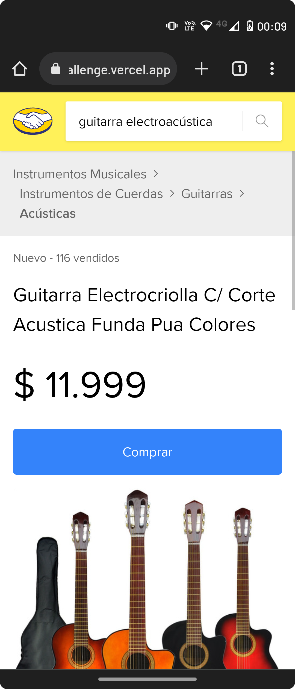
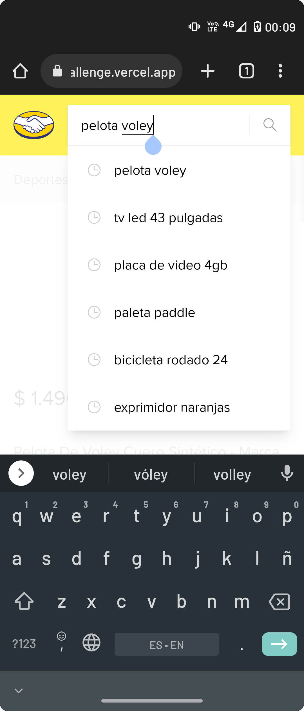

## Challenge para web developer <a style="color:#fff159" href="https://www.mercadolibre.com.ar/">Mercado Libre</a> 🇦🇷

> [Repo](https://github.com/jarraga/meli-challenge)

> [Live demo](https://jarraga-meli-challenge.vercel.app)





---
### 💻 Tech stack

- [Next.js](https://nextjs.org/docs) + [Typescript](https://www.typescriptlang.org/docs/handbook/2/basic-types.html)
- [tailwindcss](https://tailwindcss.com/docs/installation)
- [FramerMotion](https://www.framer.com/docs/animation)

### 🧩 Características

- Búsqueda de ítems
- Detalle de producto
- Sugerencias
- Búsquedas recientes
- Botón compartir
- Detección de link en texto recibido de la descripción
- Transición entre páginas (custom hook)
- Open graph tags

### ℹ️ Aclaraciones

- Las interfaces de las respuestas de la api de meli fueron generadas con [Json to Typescript](https://transform.tools/json-to-typescript), sería bueno que meli tenga sus tipos o alguna documentación tipo swagger

---

### ⚙️ Setup

- Varibales de entorno

```properties
NAME=Nombre
LASTNAME=Apellido
API_BASE_URL=https://api.mercadolibre.com/
API_SEARCH_LIMIT=4
SUGGESTIONS_API_BASE_URL=https://http2.mlstatic.com/
SUGGESTIONS_API_LIMIT=6
BFF_API_BASE_URL=http://localhost:3000/api/
NEXT_PUBLIC_APP_BASE_URL=http://localhost:3000
```
- Comandos

```bash
# install dependencies
npm i

# run development server
npm run dev

# build for production
npm run build

# start production server
npm start
```

- ⚡️ [Prueba de rendimiento](https://pagespeed.web.dev/report?url=https%3A%2F%2Fjarraga-meli-challenge.vercel.app%2F)

---

Por [@jorge.arraga](https://www.instagram.com/jorge.arraga/)